# Medidas de seguridad en LiveNotes

## Visión general

La seguridad de LiveNotes se implementa en dos capas: **backend (Node/Express)** y **frontend (Angular)**. El backend es la línea de defensa real; el frontend añade experiencia de usuario y reduce carga innecesaria al servidor, pero nunca reemplaza la validación del servidor.

---

## 1 — Autenticación con JWT dual (access + refresh token) + rotación

**Dónde:** `app/utils/jwt.js`, `app/middleware/auth.middleware.js`, `app/controller/user.controller.js`

El sistema usa dos tokens con ciclos de vida distintos:

```js
// jwt.js
export const generarAccessToken  = (payload) => jwt.sign(payload, JWT_SECRET,         { expiresIn: '15m' });
export const generarRefreshToken = (payload) => jwt.sign(payload, JWT_REFRESH_SECRET,  { expiresIn: '7d'  });
```

El **access token** (15 min) viaja en la cabecera `Authorization: Bearer ...` en cada petición. El **refresh token** (7 días) se guarda en la base de datos y se envía al cliente solo por cookie httpOnly.

Cuando el middleware detecta un access token expirado, intenta un refresco automático antes de devolver un 401. En cada refresco —tanto el explícito (`/user/refresh`) como el silencioso del middleware— se emite un nuevo refresh token que reemplaza al anterior en BD:

```js
// user.controller.js — refresh()
const newRefreshToken = generarRefreshToken(newPayload);
user.refreshToken = newRefreshToken;           // invalida el token anterior
await user.save();
res.cookie('refreshToken', newRefreshToken, cookieOpts);
res.status(200).json({ accessToken, refreshToken: newRefreshToken });
```

La misma lógica está replicada en `auth.middleware.js` para el refresco silencioso.

**Protege contra:**
- Robo de token por interceptación de red (el access token expira en 15 min).
- Sesiones eternas tras compromiso de un dispositivo (el refresh token puede revocarse en BD).
- Reutilización de un refresh token robado: la rotación lo invalida en el siguiente uso legítimo.

---

## 2 — Cookies httpOnly, Secure y SameSite

**Dónde:** `app/controller/user.controller.js` (login)

```js
const isSecure = req.secure || req.headers['x-forwarded-proto'] === 'https';
const cookieOpts = {
  httpOnly: true,
  secure:   isSecure,
  sameSite: isSecure ? 'none' : 'lax',
};
res.cookie('refreshToken', refreshToken, { ...cookieOpts, maxAge: 7 * 24 * 60 * 60 * 1000 });
```

| Atributo | Efecto |
|----------|--------|
| `httpOnly: true` | JavaScript del navegador no puede leer la cookie |
| `secure: true` (producción) | Solo se transmite por HTTPS |
| `sameSite: 'none'` (HTTPS) / `'lax'` (HTTP) | Bloquea envío en peticiones cross-site |

**Protege contra:**
- **XSS** — un script inyectado no puede robar el refresh token porque `httpOnly` lo bloquea.
- **CSRF** — `sameSite` impide que peticiones de otros dominios adjunten automáticamente la cookie.

---

## 3 — Access token en memoria (no en localStorage)

**Dónde:** `src/app/services/auth.service.ts`

El access token nunca se escribe en `localStorage`. Vive en una variable de módulo en memoria, fuera del alcance de cualquier script externo:

```ts
// Fuera de la clase — no accesible desde la consola ni desde scripts inyectados
let _inMemoryAccessToken: string | null = null;

// En login:
_inMemoryAccessToken = res.accessToken;

// getToken() lo lee desde memoria, no desde localStorage
getToken(): string | null {
  return _inMemoryAccessToken;
}

// clearUser() lo borra de memoria
clearUser(): void {
  _inMemoryAccessToken = null;
  // ...
}
```

El refresh token sigue en `localStorage` (persistencia entre recargas), pero al ser de más larga duración y viajar únicamente en el body de `/user/refresh`, el riesgo es mucho menor que el del access token, que se envía en cada petición.

Cuando la página se recarga, `_inMemoryAccessToken` empieza en `null`. La primera petición autenticada recibe un 401, el interceptor llama a `/user/refresh` usando el refresh token de `localStorage`, y el nuevo access token queda en memoria. El usuario no nota nada.

**Protege contra:** XSS — aunque un script malicioso logre ejecutarse, no puede leer el access token para hacer peticiones autenticadas en nombre del usuario.

---

## 4 — Refresco automático en el frontend

**Dónde:** `src/app/interceptors/auth-error.interceptor.ts`

El interceptor captura respuestas 401 y reintenta la petición original con un nuevo token sin que el usuario lo perciba. Además, si el servidor devuelve un nuevo refresh token (rotación), lo persiste en `localStorage`:

```ts
switchMap(res => {
  auth.setToken(res.accessToken);
  if (res.refreshToken) auth.setRefreshToken(res.refreshToken);  // persiste la rotación
  const retried = req.clone({ setHeaders: { Authorization: `Bearer ${res.accessToken}` } });
  return next(retried);
})
```

Si el refresh también falla (token revocado, expirado en BD), redirige al login y limpia todo el almacenamiento local.

**Protege contra:** que una sesión legítima se corte abruptamente por expiración, sin exponer credenciales en el proceso.

---

## 5 — Cabeceras de seguridad HTTP (Helmet)

**Dónde:** `app/app.js`

```js
app.use(helmet({
    crossOriginResourcePolicy: { policy: 'cross-origin' },
}));
```

Helmet añade automáticamente las siguientes cabeceras en todas las respuestas:

| Cabecera | Efecto |
|----------|--------|
| `Content-Security-Policy` | Restringe orígenes de scripts, estilos e iframes |
| `X-Frame-Options: SAMEORIGIN` | Impide que la app sea incrustada en un iframe externo |
| `X-Content-Type-Options: nosniff` | Evita que el navegador interprete tipos MIME incorrectos |
| `Strict-Transport-Security` | Fuerza HTTPS en futuros accesos |
| `X-DNS-Prefetch-Control: off` | Reduce filtración de información por DNS |
| `Referrer-Policy: no-referrer` | No envía la URL actual como referrer |

`crossOriginResourcePolicy: 'cross-origin'` está configurado explícitamente para no bloquear las peticiones legítimas del frontend Angular.

**Protege contra:** clickjacking, MIME sniffing, downgrade a HTTP, XSS (reforzado por CSP) y filtración de información por cabeceras.

---

## 6 — Sanitización contra NoSQL injection

**Dónde:** `app/app.js`

```js
app.use(mongoSanitize());
```

`express-mongo-sanitize` elimina del body, query y params cualquier clave que empiece por `$` o contenga `.` antes de que los controladores procesen la petición. Sin esto, un atacante podría enviar:

```json
{ "email": { "$gt": "" } }
```

…y Mongoose lo interpretaría como un operador de consulta, potencialmente devolviendo el primer usuario de la base de datos sin necesidad de conocer un email real.

**Protege contra:** NoSQL injection en cualquier campo de texto que se use directamente en queries de Mongoose.

---

## 7 — Control de acceso basado en permisos (RBAC)

**Dónde:** `app/models/user.model.js`, `app/middleware/admin.middleware.js`, `src/app/guards/`

Los permisos son numéricos y se almacenan en `User.permisos` con valores enum restringidos:

```js
// user.model.js
permisos: { type: Number, enum: { values: [1, 2, 3, 13579] } }
```

El acceso admin requiere pasar dos middlewares encadenados en el router:

```js
// Solo autenticado no basta; debe ser admin
router.post('/admin/accion', authMiddleware, adminMiddleware, controlador);

// admin.middleware.js
if (!req.user || req.user.permisos !== 13579)
  return res.status(403).json({ message: 'Acceso denegado' });
```

El endpoint `simulate-toggle` (que alterna el plan premium sin pasar por Stripe) solo se registra fuera de producción:

```js
// stripe.router.js
if (process.env.NODE_ENV !== 'production') {
    router.post('/stripe/simulate-toggle', authMiddleware, simulateToggle);
}
```

El frontend tiene guards (`auth.guard.ts`, `admin.guard.ts`) que bloquean la navegación a rutas protegidas, pero su único propósito es la UX: la autorización real ocurre en el servidor.

**Protege contra:** escalada de privilegios, acceso a endpoints de desarrollo en producción y acceso a rutas de admin sin los permisos correspondientes.

---

## 8 — Hashing de contraseñas con bcrypt

**Dónde:** `app/controller/user.controller.js`

```js
// Registro y cambio de contraseña
const hashedPassword = await bcrypt.hash(password, 10);

// Login
if (!await bcrypt.compare(password, resultado.password))
  return res.status(401).json({ message: 'Usuario o contraseña incorrectos' });
```

El cost factor 10 impone ~100 ms por hash. Bcrypt incorpora salt aleatorio automáticamente, por lo que dos usuarios con la misma contraseña producen hashes distintos.

**Protege contra:** ataques de rainbow table y cracking por fuerza bruta en caso de brecha de la base de datos.

---

## 9 — Reglas de complejidad de contraseña

**Dónde:** `app/controller/user.controller.js`

```js
const validarPassword = (password) => {
  if (password.length < 8)       return 'Mínimo 8 caracteres';
  if (!/[A-Z]/.test(password))   return 'Al menos una mayúscula';
  if (!/[0-9]/.test(password))   return 'Al menos un número';
  return null;
};
```

Se aplica en registro, cambio de contraseña y reset. La validación está en el servidor, no solo en el formulario Angular.

**Protege contra:** ataques de diccionario y fuerza bruta al exigir un espacio de contraseñas más amplio.

---

## 10 — Tokens de un solo uso hasheados en BD

**Dónde:** `app/utils/token.js`, `app/controller/user.controller.js`

Todos los tokens de acción (verificación de email, cambio de contraseña, reset y eliminación de cuenta) se generan con 256 bits de entropía y se almacenan **hasheados con SHA-256** en la base de datos. El token en texto plano solo viaja por email:

```js
// token.js
export const generarToken = () => crypto.randomBytes(32).toString('hex');
export const hashToken    = (token) => crypto.createHash('sha256').update(token).digest('hex');

// Al guardar (registro, forgot-password, etc.)
resultado.tokenVerificacion = hashToken(token);  // solo el hash va a BD
await sendVerificacionEmail(email, token);        // el raw va al email

// Al verificar (el token llegó por URL/email)
const resultado = await User.findOne({ tokenVerificacion: hashToken(token) });
```

Si la base de datos es comprometida, el atacante obtiene solo los hashes, que no pueden usarse directamente para activar los enlaces de verificación.

**Protege contra:**
- Brecha de base de datos que exponga tokens activos — los hashes son inútiles sin el raw.
- Registros con emails falsos o de terceros.
- Reuso de enlaces de verificación (el token se pone a `null` tras el primer uso).

---

## 11 — Enumeración de usuarios

**Dónde:** `app/controller/user.controller.js`

Tanto el endpoint de forgot-password como el de **registro** devuelven respuestas idénticas independientemente de si el email existe o no:

```js
// forgotPassword — siempre la misma respuesta
return res.status(200).json({ message: 'Si el email existe, recibirás un enlace...' });

// register — email ya registrado devuelve el mismo mensaje que un registro nuevo
if (check) {
    return res.status(201).json({ message: 'Usuario registrado, revisa tu email para verificar tu cuenta' });
}
```

**Protege contra:** enumeración de usuarios — el atacante no puede construir una lista de emails registrados observando diferencias en las respuestas.

---

## 12 — Recuperación de contraseña segura

**Dónde:** `app/controller/user.controller.js` (`forgotPassword`, `resetPassword`)

```js
// Token con caducidad de 1 hora
resultado.tokenCambioPasswordExpira = new Date(Date.now() + 60 * 60 * 1000);

// Se invalida al usarse
resultado.tokenCambioPassword = null;
resultado.tokenCambioPasswordExpira = null;
```

**Protege contra:**
- **Replay attacks** — el token expira en 1 hora y se destruye tras el primer uso.
- **Brecha de BD** — el token está hasheado (ver sección 10), no en texto plano.

---

## 13 — Rate limiting por IP

**Dónde:** `app/middleware/rate.middleware.js`

```js
export const loginLimiter = rateLimit({
  windowMs: 15 * 60 * 1000,  // ventana de 15 min
  max: 5,                     // 5 intentos máximo
  message: { message: 'Demasiados intentos, espera 15 minutos' },
});

export const registerLimiter = rateLimit({
  windowMs: 60 * 60 * 1000,
  max: 10,
});

export const generalLimiter = rateLimit({
  windowMs: 15 * 60 * 1000,
  max: 100,
});
```

`app.js` activa `trust proxy: 1` para que el limitador lea la IP real detrás de un reverse proxy (Nginx, etc.).

**Protege contra:** fuerza bruta en login, spam de registros y denegación de servicio (DoS) básica.

---

## 14 — CORS con lista blanca de orígenes

**Dónde:** `app/app.js`

```js
const allowedOrigins = [process.env.FRONTEND_URL, 'http://localhost:4200'].filter(Boolean);

const corsOption = {
  origin: (origin, callback) => {
    if (!origin || allowedOrigins.includes(origin)) callback(null, true);
    else callback(new Error('Not allowed by CORS'));
  },
  credentials: true,  // necesario para enviar cookies
};
```

Solo los orígenes explícitamente listados pueden hacer peticiones credenciadas. Cualquier otro dominio recibe un error de CORS.

**Protege contra:** peticiones cross-origin maliciosas desde dominios no autorizados.

---

## 15 — Verificación de firma en webhooks de Stripe

**Dónde:** `app/controller/stripe.controller.js`

```js
// app.js: el webhook recibe el body crudo (sin parsear)
app.post('/api/stripe/webhook', express.raw({ type: 'application/json' }), stripeWebhook);

// stripe.controller.js
event = stripe.webhooks.constructEvent(req.body, req.headers['stripe-signature'], STRIPE_WEBHOOK_SECRET);
```

Stripe firma cada webhook con `STRIPE_WEBHOOK_SECRET`. Si el body ha sido manipulado en tránsito o la firma no coincide, la construcción del evento lanza una excepción y la petición se rechaza con 400.

**Protege contra:** webhooks falsificados que podrían activar upgrades de plan sin pago real.

---

## 16 — Aislamiento de datos por propietario

**Dónde:** Todos los controladores de datos (`nota.controller.js`, `evento.controller.js`, `finance.controller.js`, etc.)

Cada consulta incluye el `userId` extraído del JWT verificado, no del body de la petición:

```js
// nota.controller.js
const notas = await Nota.find({ usuario: req.user.id });
const nota  = await Nota.findOneAndDelete({ _id: id, usuario: req.user.id });
```

Un usuario autenticado que envíe el `_id` de la nota de otro usuario recibirá un 404: la consulta no encontrará el documento porque el `usuario` no coincide.

**Protege contra:** escalada de privilegios horizontal — acceder o modificar datos de otros usuarios adivinando IDs de MongoDB.

---

## Capas de seguridad — flujo extremo a extremo

Ejemplo: `GET /api/events/calendar` (leer eventos del calendario del usuario autenticado).

```mermaid
flowchart LR
    U(["👤 Usuario"])

    U -->|navega a /calendar| AG

    subgraph FE ["☁️  Frontend — Angular"]
        direction TB
        AG["① Auth Guard
        Sin sesión → redirige a /login"]
        AG -->|sesión activa| INT
        INT["② HTTP Interceptor
        Añade Authorization: Bearer &lt;accessToken&gt;
        El token vive en memoria, nunca en localStorage"]
    end

    INT -->|petición HTTPS| TLS

    subgraph BE ["🖥️  Backend — Node / Express + MongoDB"]
        direction TB
        TLS["③ HTTPS / HSTS
        Tráfico cifrado en tránsito
        Strict-Transport-Security vía Helmet"]

        TLS --> CORS_M
        CORS_M["④ CORS
        Origen en lista blanca?"]
        CORS_M -->|origen no permitido| R1["🚫 Error CORS"]
        CORS_M -->|✓| HLM

        HLM["⑤ Helmet
        CSP · X-Frame-Options
        X-Content-Type-Options · Referrer-Policy…"]
        HLM --> RL

        RL["⑥ Rate Limiter
        100 req / 15 min por IP"]
        RL -->|límite superado| R2["🚫 429 Too Many Requests"]
        RL -->|✓| SAN

        SAN["⑦ mongo-sanitize
        Elimina claves con $ o . del body/query
        Previene NoSQL injection"]
        SAN --> AUTH

        AUTH["⑧ authMiddleware
        Verifica firma JWT con JWT_SECRET"]
        AUTH -->|firma inválida / token revocado| R3["🚫 401 Unauthorized"]
        AUTH -->|token expirado| REF["🔄 Refresco silencioso
        Nuevo access token desde cookie httpOnly"]
        REF -->|refresh inválido| R3
        REF -->|✓| CTRL
        AUTH -->|✓| CTRL

        CTRL["⑨ evento.controller.js
        Evento.find &#40;{ userId: req.user.id }&#41;
        userId sacado del JWT, nunca del body"]
        CTRL --> MDB

        MDB["⑩ MongoDB — Filtro por propietario
        Solo documentos donde userId coincide
        Un _id ajeno devuelve array vacío"]
    end

    MDB -->|datos filtrados| RES(["✅ 200 OK
    Solo los eventos del usuario autenticado"])
```



> **Dónde puede fallar una petición maliciosa**
>
> | Zona | Intento | Capa que lo detiene |
> |------|---------|---------------------|
> | **Frontend** | Sin sesión activa | ① Auth Guard → redirige a /login antes de enviar nada |
> | **Frontend** | Token robado de localStorage | ② Interceptor — el access token nunca está en localStorage |
> | **Backend** | Origen no autorizado | ④ CORS → bloqueado antes de cualquier lógica de negocio |
> | **Backend** | Flood / scraping | ⑥ Rate Limiter → 429 |
> | **Backend** | Payload con `$gt`, `$where`… | ⑦ mongo-sanitize → operador eliminado del query |
> | **Backend** | Token falsificado o expirado | ⑧ authMiddleware → 401 |
> | **Backend** | Token válido pero de otro usuario | ⑨ + ⑩ → el `userId` del JWT no coincide con los documentos → resultado vacío o 404 |

---

## Resumen por tipo de ataque

| Ataque | Medidas que lo mitigan |
|--------|----------------------|
| **XSS** | Cookie httpOnly, access token en memoria (sección 3), CSP via Helmet |
| **CSRF** | SameSite cookie, CORS con lista blanca |
| **Robo de token** | Access token de 15 min + en memoria, refresh token rotado y revocable en BD |
| **Fuerza bruta / diccionario** | Rate limiting (5 intentos/15 min), bcrypt cost 10, complejidad de contraseña |
| **Rainbow table** | bcrypt con salt automático |
| **Enumeración de usuarios** | Respuestas genéricas en login, forgot-password y registro |
| **Replay de tokens** | Tokens de un solo uso, caducidad de 1 hora en reset, rotación de refresh token |
| **Brecha de BD (tokens activos)** | Tokens de acción guardados como hash SHA-256 |
| **NoSQL injection** | express-mongo-sanitize elimina operadores `$` del input |
| **Clickjacking** | X-Frame-Options via Helmet |
| **Downgrade a HTTP** | Strict-Transport-Security via Helmet |
| **Escalada horizontal** | userId de JWT en todas las consultas |
| **Escalada vertical** | RBAC numérico + doble middleware auth+admin |
| **Endpoint dev en producción** | simulate-toggle desactivado si `NODE_ENV=production` |
| **Webhook falso** | Firma HMAC verificada con STRIPE_WEBHOOK_SECRET |
| **Peticiones cross-origin** | CORS con lista blanca explícita |
| **DoS básico** | Rate limiting general (100 req/15 min por IP) |
| **Registro con email falso** | Verificación por token criptográfico hasheado (256 bits) |
